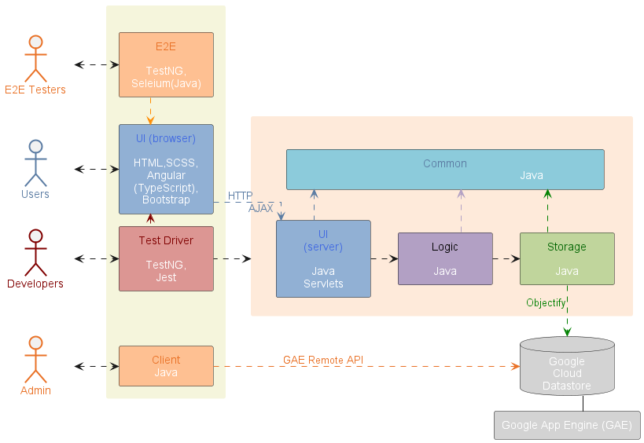

# Essay 4

### SE 339 - Team 9 Paste

Group members:
- Elvis Kimara
- Jack Doe
- Jacob Larson
- Phuoc Nguyen

## Introduction

High level architecture of TEAMMATES:

TEAMMATES is a Web application that runs on Google App Engine. It has four main components:
- UI Component
- Logic Component
- Storage Component
- Common Component

## Logic Component

The Logic component handles the business logic of TEAMMATES. In particular, it is responsible for:

- Managing relationships between entities, e.g. cascade logic for create/update/delete.
- Managing transactions, e.g. ensuring atomicity of a transaction.
- Sanitizing input values received from the UI component.
- Connecting to GCP or third-party services, e.g. for adding tasks to the task queue and for sending emails with third-party providers.

Package overview:

- **`logic.api`**: Provides the API of the component to be accessed by the UI.
- **`logic.core`**: Contains the core logic of the system.
- **`logic.external`**: Holds the logic of external services such as task queue service.

### Logic API

Represented by these classes:

- `Logic`: A [Facade class](http://en.wikipedia.org/wiki/Facade_pattern) which connects to the several `*Logic` classes to handle the logic related to various types of data and to access data from the `Storage` component.
- `UserProvision`: Retrieves user information (based on request cookies).
- `EmailGenerator`: Generates emails to be sent.
- `EmailSender`: Sends email with the provider chosen based on the build configuration.
- `TaskQueuer`: Adds tasks to the task queue, i.e. to be executed at a later time.
- `FileStorage`: Manages CRUD of binary files such as profile pictures.
- `LogsProcessor`: For more advanced usage of logging that cannot be captured by the standard logger class.
- `RecaptchaVerifier`: For verification of the reCAPTCHA token.

Many classes in this layer make use of proxy pattern, i.e. they only connect to production services such as Google Cloud Storage in the staging/production server.

### Policies

Access control:

+ Although this component provides methods that are relevant to access control (e.g. providing user information), the access control check itself does not happen in this component. The UI is expected to check access control (using `GateKeeper` class) before calling a method in the logic component.

API for creating entities:

+ Null parameters: Causes an assertion failure.
+ Invalid parameters: Throws `InvalidParametersException`.
+ Entity already exists: Throws `EntityAlreadyExistsException` (escalated from Storage level).

API for retrieving entities:

+ Attempting to retrieve objects using null
 parameters: Causes an assertion failure.
+ Entity not found:
  - Returns null if the target entity not found. This way, read operations can be used easily for checking the existence of an entity.

API for updating entities:

+ Update is done using `*UpdateOptions` inside every `*Attributes`. The `UpdateOptions` will specify what is used to identify the entity to update and what will be updated.
+ Entity not found: Throws `EntityDoesNotExistException`.
+ Invalid parameters: Throws `InvalidParametersException`.

API for deleting entities:

+ FailDeleteSilentlyPolicy: In general, delete operation do not throw exceptions if the target entity does not exist. This is because if it does not exist, it is as good as deleted.
+ Cascade policy:   When a parent entity is deleted, entities that have referential integrity with the deleted entity should also be deleted.
  Refer to the API for the cascade logic.

## Conclusion
In general, Logic Component is an extremely important component in Teammates. It helps to handle logical elements of the system without human interaction. Through this component, the data will be screened and processed to serve the data retrieval needs of the user.